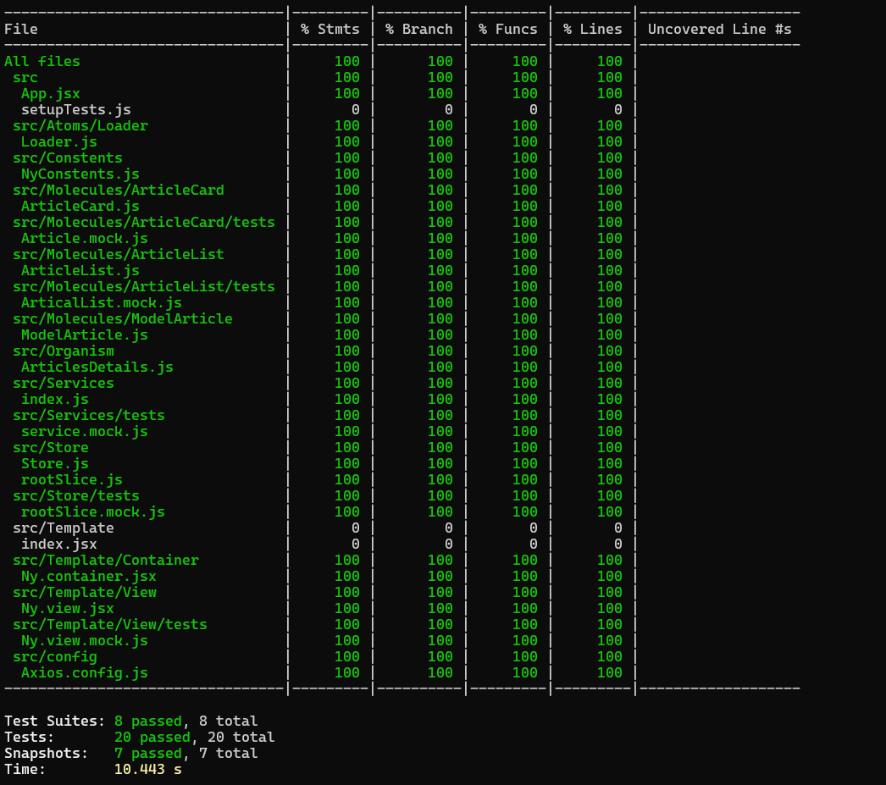
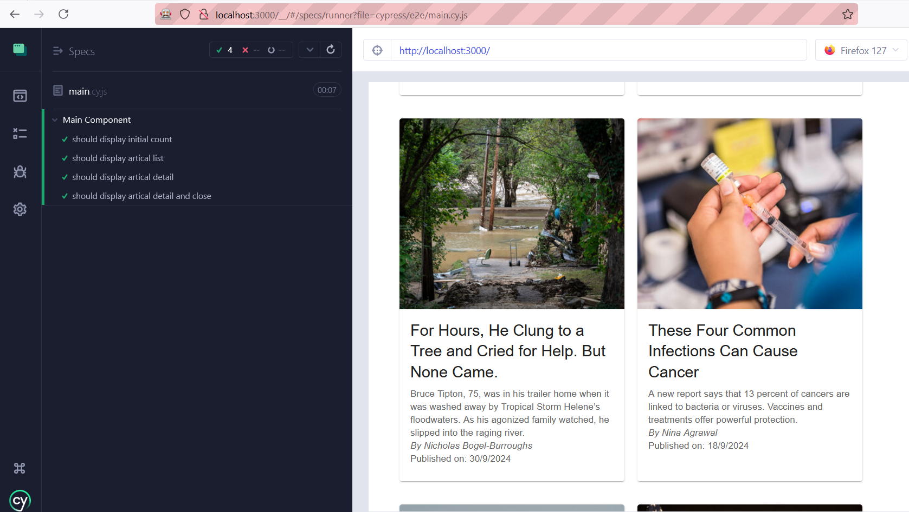

# NY Times Articals App

This is a React web application to displays the most popular articles from the NY Times Most Popular Articles API. It provides detail for users to view list of articles and detail of each artical by clicking on it.

## Prerequisites

Install latest Node version (Used Node 22) 

## Installation

1. Clone this repository to your local machine using `https://github.com/ajaygargdev/Ny-Times.git`.
2. Navigate to the project directory `cd Ny-Times`.
3. Run `npm install` to install the dependencies.

## Commands Usage

- `npm start`: Starts the application on local machine.
- `npm build`: Build the application for production.
- `npm test`: Runs testcase.
- `npm run coverage`: Runs testcase with coverage report.
- `npm run lint`: Lints the code.
- `npm run lint:fix`: Fixes ESLint errors.
- `npm run format`: Formats code using Prettier.
- `npx cypress open`: Run Visual Test.

## Test Coverage Report

## Visual Coverage Report

## Main techonology/feature used

- React - To build application
- Redux - To Manage state
- Axios - To call apis
- EsLint - For linting
- Jest - For testing
- React-testing-library - For testing
- Cypress - For visual testing
- SonarQube - For Code quality and Security Vulnerabilities

